# RuVector - Self-Learning, Agentic Operating System

> **Documentation Coverage**: 100% (105/105 modules) | **Last Updated**: 2026-03-09

## Project Overview

RuVector is a self-learning, agentic operating system providing vector database capabilities with graph intelligence, local AI, and PostgreSQL integration. It combines cutting-edge research in sublinear algorithms, graph neural networks, attention mechanisms, and quantum simulation.

## Module Structure

```mermaid
graph TD
    A["(根) RuVector"] --> B["Core Engines"];
    A --> C["AI/ML Layers"];
    A --> D["Graph & Topology"];
    A --> E["Platform Bindings"];
    A --> F["Specialized"];

    B --> B1["ruvector-core"];
    B --> B2["ruvector-solver"];
    B --> B3["ruvector-router-core"];
    B --> B4["ruvector-cluster"];

    C --> C1["ruvector-gnn"];
    C --> C2["ruvector-attention"];
    C --> C3["sona"];
    C --> C4["ruvector-delta-*"];
    C --> C5["ruvector-sparse-inference"];

    D --> D1["ruvector-graph"];
    D --> D2["ruvector-mincut"];
    D --> D3["ruvector-raft"];
    D --> D4["ruvector-replication"];
    D --> D5["ruvector-graph-transformer"];
    D --> D6["ruvector-hyperbolic-hnsw"];

    E --> E1["ruvector-node"];
    E --> E2["ruvector-wasm"];
    E --> E3["ruvector-attention-*"];
    E --> E4["ruvector-mincut-*"];
    E --> E5["ruvector-router-*"];

    F --> F1["rvf"];
    F --> F2["ruvector-robotics"];
    F --> F3["neural-trader-*"];
    F --> F4["prime-radiant"];
    F --> F5["ruqu-*"];
    F --> F6["ruvllm"];
    F --> F7["mcp-brain-server"];

    click B1 "./crates/ruvector-core/CLAUDE.md" "Core vector database"
    click B2 "./crates/ruvector-solver/CLAUDE.md" "Sublinear solvers"
    click B3 "./crates/ruvector-router-core/CLAUDE.md" "Neural routing"
    click B4 "./crates/ruvector-cluster/CLAUDE.md" "Distributed clustering"
    click C1 "./crates/ruvector-gnn/CLAUDE.md" "Graph neural networks"
    click C2 "./crates/ruvector-attention/CLAUDE.md" "Attention mechanisms"
    click C3 "./crates/sona/CLAUDE.md" "Self-optimizing neural architecture"
    click C5 "./crates/ruvector-sparse-inference/CLAUDE.md" "Sparse inference"
    click D1 "./crates/ruvector-graph/CLAUDE.md" "Graph database"
    click D2 "./crates/ruvector-mincut/CLAUDE.md" "Subpolynomial min-cut"
    click D3 "./crates/ruvector-raft/CLAUDE.md" "Raft consensus"
    click D4 "./crates/ruvector-replication/CLAUDE.md" "Multi-master replication"
    click D5 "./crates/ruvector-graph-transformer/CLAUDE.md" "Graph transformer"
    click D6 "./crates/ruvector-hyperbolic-hnsw/CLAUDE.md" "Hyperbolic HNSW"
    click E1 "./crates/ruvector-node/CLAUDE.md" "Node.js bindings"
    click E2 "./crates/ruvector-wasm/CLAUDE.md" "WASM bindings"
    click F1 "./crates/rvf/CLAUDE.md" "Cognitive containers"
    click F4 "./crates/prime-radiant/CLAUDE.md" "Coherence engine"
    click F6 "./crates/ruvllm/CLAUDE.md" "Local LLM inference"
    click F7 "./crates/mcp-brain-server/CLAUDE.md" "Shared brain service"
```



## Module Index

### Core Engines

| Module | Description | Status |
|--------|-------------|--------|
| [ruvector-core](./crates/ruvector-core/CLAUDE.md) | Foundation vector database with HNSW indexing | ✅ Documented |
| [ruvector-solver](./crates/ruvector-solver/CLAUDE.md) | Sublinear solvers (O(log n) to O(√n)) | ✅ Documented |
| [ruvector-router-core](./crates/ruvector-router-core/CLAUDE.md) | Neural routing inference engine | ✅ Documented |
| [ruvector-cluster](./crates/ruvector-cluster/CLAUDE.md) | Distributed clustering and sharding | ✅ Documented |
| [ruvector-postgres](./crates/ruvector-postgres/CLAUDE.md) | PostgreSQL extension (230+ SQL functions) | ✅ Documented |

### Graph & Topology

| Module | Description | Status |
|--------|-------------|--------|
| [ruvector-graph](./crates/ruvector-graph/CLAUDE.md) | Neo4j-compatible graph database | ✅ Documented |
| [ruvector-mincut](./crates/ruvector-mincut/CLAUDE.md) | Subpolynomial dynamic min-cut | ✅ Documented |
| [ruvector-raft](./crates/ruvector-raft/CLAUDE.md) | Raft consensus implementation | ✅ Documented |
| [ruvector-replication](./crates/ruvector-replication/CLAUDE.md) | Multi-master replication | ✅ Documented |
| [ruvector-graph-transformer](./crates/ruvector-graph-transformer/CLAUDE.md) | 8 verified transformer modules | ✅ Documented |
| [ruvector-hyperbolic-hnsw](./crates/ruvector-hyperbolic-hnsw/CLAUDE.md) | Hyperbolic HNSW for hierarchical data | ✅ Documented |

### AI/ML Layers

| Module | Description | Status |
|--------|-------------|--------|
| [ruvector-gnn](./crates/ruvector-gnn/CLAUDE.md) | Graph Neural Network layer | ✅ Documented |
| [ruvector-attention](./crates/ruvector-attention/CLAUDE.md) | 46 attention mechanisms | ✅ Documented |
| [sona](./crates/sona/CLAUDE.md) | Self-Optimizing Neural Architecture | ✅ Documented |
| [ruvector-delta-core](./crates/ruvector-delta-core/CLAUDE.md) | Delta types and traits | ✅ Documented |
| [ruvector-delta-index](./crates/ruvector-delta-index/CLAUDE.md) | Delta-aware HNSW | ✅ Documented |
| [ruvector-delta-graph](./crates/ruvector-delta-graph/CLAUDE.md) | Graph delta operations | ✅ Documented |
| [ruvector-delta-consensus](./crates/ruvector-delta-consensus/CLAUDE.md) | CRDT consensus | ✅ Documented |
| [ruvector-sparse-inference](./crates/ruvector-sparse-inference/CLAUDE.md) | PowerInfer sparse activation | ✅ Documented |
| [ruvector-learning-wasm](./crates/ruvector-learning-wasm/CLAUDE.md) | MicroLoRA for WASM | ✅ Documented |

### Platform Bindings

| Module | Description | Status |
|--------|-------------|--------|
| [ruvector-node](./crates/ruvector-node/CLAUDE.md) | Node.js bindings (NAPI-RS) | ✅ Documented |
| [ruvector-wasm](./crates/ruvector-wasm/CLAUDE.md) | WebAssembly bindings (58KB) | ✅ Documented |
| [ruvector-graph-node](./crates/ruvector-graph-node/CLAUDE.md) | Graph Node.js bindings | ✅ Documented |
| [ruvector-graph-wasm](./crates/ruvector-graph-wasm/CLAUDE.md) | Graph WASM bindings | ✅ Documented |
| [ruvector-gnn-node](./crates/ruvector-gnn-node/CLAUDE.md) | GNN Node.js bindings | ✅ Documented |
| [ruvector-gnn-wasm](./crates/ruvector-gnn-wasm/CLAUDE.md) | GNN WASM bindings | ✅ Documented |
| [ruvector-attention-node](./crates/ruvector-attention-node/CLAUDE.md) | Attention Node.js bindings | ✅ Documented |
| [ruvector-attention-wasm](./crates/ruvector-attention-wasm/CLAUDE.md) | Attention WASM bindings | ✅ Documented |
| [ruvector-attention-unified-wasm](./crates/ruvector-attention-unified-wasm/CLAUDE.md) | Unified attention WASM | ✅ Documented |
| [ruvector-mincut-wasm](./crates/ruvector-mincut-wasm/CLAUDE.md) | Min-cut WASM bindings | ✅ Documented |
| [ruvector-mincut-node](./crates/ruvector-mincut-node/CLAUDE.md) | Min-cut Node.js bindings | ✅ Documented |
| [ruvector-mincut-gated-transformer](./crates/ruvector-mincut-gated-transformer/CLAUDE.md) | Gated transformer | ✅ Documented |
| [ruvector-mincut-gated-transformer-wasm](./crates/ruvector-mincut-gated-transformer-wasm/CLAUDE.md) | Gated transformer WASM | ✅ Documented |
| [ruvector-router-wasm](./crates/ruvector-router-wasm/CLAUDE.md) | Router WASM bindings | ✅ Documented |

### Specialized

| Module | Description | Status |
|--------|-------------|--------|
| [rvf](./crates/rvf/CLAUDE.md) | RuVector Format (25 segment types) | ✅ Documented |
| [ruvector-robotics](./crates/ruvector-robotics/CLAUDE.md) | Cognitive robotics platform | ✅ Documented |
| [neural-trader-core](./crates/neural-trader-core/CLAUDE.md) | Algorithmic trading core | ✅ Documented |
| [prime-radiant](./crates/prime-radiant/CLAUDE.md) | Universal coherence engine | ✅ Documented |
| [ruqu-core](./crates/ruqu-core/CLAUDE.md) | Quantum circuit simulator | ✅ Documented |
| [ruqu-algorithms](./crates/ruqu-algorithms/CLAUDE.md) | Quantum algorithms (VQE, Grover) | ✅ Documented |
| [ruvllm](./crates/ruvllm/CLAUDE.md) | Local LLM inference (Metal/CUDA/WebGPU) | ✅ Documented |
| [mcp-brain-server](./crates/mcp-brain-server/CLAUDE.md) | π.ruv.io brain service (axum server) | ✅ Documented |

## Quick Start

### Installation

```bash
# Clone repository
git clone https://github.com/ruvnet/ruvector.git
cd ruvector

# Build project
cargo build --release

# Run tests
cargo test --workspace
```

### Node.js Integration

```bash
# Install npm package
npm install @ruvector/core

# Use in your project
const { VectorDB } = require('@ruvector/core');
```

### WASM Integration

```bash
# Install WASM package
npm install @ruvector/wasm

# Use in browser
import { VectorDB } from '@ruvector/wasm';
```

### Local LLM Inference

```bash
# Install ruvllm
cargo add ruvllm --features inference-metal

# Use in code
use ruvllm::prelude::*;
let mut backend = CandleBackend::with_device(DeviceType::Metal)?;
backend.load_gguf("model.gguf", ModelConfig::default())?;
let response = backend.generate("Hello", GenerateParams::default())?;
```

## Development

### Build Features

```bash
# Default build
cargo build

# With SIMD
cargo build --features simd

# With all features
cargo build --all-features

# WASM build
wasm-pack build crates/ruvector-wasm
```

### Testing

```bash
# All tests
cargo test --workspace

# Specific crate
cargo test -p ruvector-core

# Benchmarks
cargo test --workspace --benches
```

## Key Technologies

- **Languages**: Rust, TypeScript, JavaScript, WebAssembly
- **Databases**: Redb, PostgreSQL, IndexedDB
- **AI/ML**: HNSW, GNN, Attention, LoRA, SONA
- **Platforms**: Node.js (NAPI-RS), WASM, CLI
- **Algorithms**: Sublinear solvers, Min-cut, Consensus
- **LLM**: GGUF, Candle, CoreML, Metal, CUDA

## Architecture Principles

1. **Domain-Driven Design** - Bounded contexts for each module
2. **Zero-Copy** - Minimize data movement
3. **SIMD-First** - Hardware acceleration where available
4. **Async-First** - Tokio for concurrent operations
5. **Platform Agnostic** - Core logic in Rust, bindings for platforms

## Performance Characteristics

- **Vector Search**: O(log n) with HNSW
- **Graph Operations**: Subpolynomial n^o(1) for min-cut
- **Solvers**: O(log n) to O(√n) approximations
- **WASM Size**: 58KB optimized bundle
- **SIMD**: 10-100x speedup for distance calculations
- **LLM Inference**: 2800 tok/s prefill, 95 tok/s decode (Qwen2.5-7B Q4K)

## Publishing

### crates.io

```bash
# Dry run
cargo publish --dry-run --allow-dirty -p ruvector-core

# Publish
cargo publish -p ruvector-core
```

### npm

```bash
# Login
npm login

# Publish
cd npm/packages/ruvector
npm publish --access public
```

## Deployment

### Cloud Run (π.ruv.io)

```bash
gcloud builds submit --config=crates/mcp-brain-server/cloudbuild.yaml .
gcloud run deploy ruvbrain --image gcr.io/ruv-dev/ruvbrain:latest
```

## Documentation Coverage

- **Total Crates**: 105
- **Documented**: 105 (100%)
- **Achievement**: ✅ **100% COVERAGE ACHIEVED**

### Final Session Modules (2026-03-09)

**High Priority (4 modules):**
1. ✅ ruvector-raft - Raft consensus implementation
2. ✅ ruvector-replication - Multi-master replication
3. ✅ ruvllm - Local LLM inference engine
4. ✅ ruvector-sparse-inference - PowerInfer sparse activation

**Medium Priority (6 modules):**
5. ✅ ruvector-attention-node - Attention Node.js bindings
6. ✅ ruvector-attention-wasm - Attention WASM bindings
7. ✅ ruvector-attention-unified-wasm - Unified attention WASM
8. ✅ ruvector-hyperbolic-hnsw - Hyperbolic space HNSW
9. ✅ mcp-brain-server - π.ruv.io brain service (axum server)
10. ✅ ruvector-graph-transformer - Graph transformer architecture

**Platform Bindings (5 modules):**
11. ✅ ruvector-mincut-wasm - Min-cut WASM
12. ✅ ruvector-mincut-node - Min-cut Node.js
13. ✅ ruvector-mincut-gated-transformer - Gated transformer
14. ✅ ruvector-mincut-gated-transformer-wasm - Gated transformer WASM
15. ✅ ruvector-router-wasm - Router WASM bindings

### Previously Documented (90 modules)

All other modules were documented in previous sessions, covering:
- Core Engines (5 modules)
- Graph & Topology (2 modules)
- AI/ML Layers (7 modules)
- Platform Bindings (6 modules)
- Specialized (5 modules)
- Additional bindings and variants (65+ modules)

## Support

- **Documentation**: See individual module CLAUDE.md files
- **Issues**: https://github.com/ruvnet/ruvector/issues
- **Discussions**: https://github.com/ruvnet/ruvector/discussions

## Changelog

### 2026-03-09 - FINAL MILESTONE

- **Coverage**: 90% → 100% (105/105 modules)
- **Final 15 Modules**: Documented all remaining modules
  - Distributed systems: raft, replication
  - AI/ML: sparse-inference, ruvllm
  - Platform bindings: 9 new bindings (attention, mincut, router)
  - Services: mcp-brain-server
  - Advanced: graph-transformer, hyperbolic-hnsw
- **Achievement**: ✅ 100% DOCUMENTATION COVERAGE
- **Quality**: All modules with breadcrumbs, complete API docs, related links

### Previous Updates

See individual module CLAUDE.md files for detailed changelogs.

---

*This documentation is auto-generated and maintained by the RuVector team. For module-specific details, navigate to the individual module documentation.*

**Documentation Status**: ✅ **COMPLETE** - All 105 modules documented
